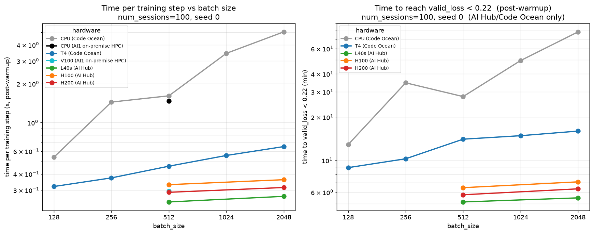

# Running disRNN on AI Hub / Beaker

Run the disRNN training stack on the Allen **AI Hub / Beaker** GPU platform.

> **Two-repo layout.** This README is the **compute / image plane** — building the
> image, the runtime code-pull, and the GPU benchmark results. The **control plane**
> — defining W&B sweeps, experiment specs, clusters, and submitting jobs — lives in
> the dispatcher:
> [`aind-disrnn-dispatcher/code/beaker/README.md`](https://github.com/AllenNeuralDynamics/aind-disrnn-dispatcher/blob/main/code/beaker/README.md).

**Architecture (two planes):**
- **Build plane — a Mac (or any box with Docker).** Builds the GPU image and
  pushes it to Beaker's registry. Needed rarely (only when dependencies change).
  *Code Ocean can't build* — its capsules are unprivileged Docker containers whose
  seccomp profile blocks the namespace creation every image builder needs.
- **Control plane — Code Ocean (or any box with the `beaker` CLI).** Creates the
  W&B sweep and submits the Beaker experiment. No GPU, no Docker.

**Key idea — code is *not* frozen in the image.** The image bakes only the
environment (Python + JAX + pinned deps). The wrapper, dispatcher,
`aind-dynamic-foraging-models`, and `aind-disentangled-rnns` sources are pulled
fresh from GitHub at job startup by `entrypoint.sh`, so day-to-day you just
**edit → push → re-run**, never rebuild. See
[Controlling the code version](#3-controlling-the-code-version).

## Migration status

Where the CO → Beaker migration stands (this section is the running log).

**Done & validated on Beaker (cluster `ai1/octo-hub-aws-l40s`, workspace
`ai1/aind-dynamic-foraging-foundation-model`):**

1. **Beaker access** — CLI installed (via `environment/postInstall` in the dispatcher),
   `BEAKER_TOKEN` auth confirmed; workspace + cluster reachable from Code Ocean.
2. **Image build** — `Dockerfile` git-clones all four repos + installs deps; built on a
   Mac (`build_and_push.sh`, `--platform linux/amd64`) and pushed to Beaker's registry
   as `han-hou/disrnn-wrapper`. CO can't build (seccomp), so the Mac is the build box.
3. **Runtime code-pull** — `entrypoint.sh` git-fetches all four repos to
   `WRAPPER_REF`/`DISPATCHER_REF`/`FORAGING_MODELS_REF`/`DISENTANGLED_RNNS_REF`
   at job start → **code edits need no rebuild**.
4. **Smoke test** — `smoke.yaml` confirmed image pull + runtime pull + GPU visible +
   Hydra config composition, no W&B.
5. **Control plane** — the dispatcher's `launch_beaker.py` creates a W&B sweep, saves a
   reproducibility record to `/results`, and submits the Beaker experiment (the
   dispatcher → wrapper hand-off, mirroring CO). A 1-point MVP run succeeded.
6. **Reproducibility** — each run stamps `wrapper_commit` / `dispatcher_commit` /
   `foraging_models_commit` / `disentangled_rnns_commit` / `CO_COMPUTATION_ID`
   into its W&B config; the dispatcher saves the sweep YAML + IDs + commit to
   `/results`.
7. **Scale-out (array of jobs)** — `replicas: 4` validated: 4 `wandb agent`s across 4
   GPUs sharing one sweep (`experiment_scaling.yaml`).

**Observed:** a single run shows **100% GPU util but only ~30% power** on the L40s
(vs ~57% on a T4 in CO). Per the W&B system metrics: util ~96%, power ~30% (106/350 W),
memory-bandwidth util ~1%, host CPU ~4%. The bottleneck is **low occupancy / kernel
overhead** — the disRNN is so small (`latent_size=5`) that each step is a long chain of
*tiny* ops, each using a sliver of the SMs (so util pins at 100% while power stays ~30%).
The wasted capacity is **spatial** (idle SMs *inside* each kernel), not temporal (idle
*time*). Two follow-up tests rule out the alternatives — **not** host-idle (item 8),
**not** eval (item 10), and not CPU / memory-BW / FLOP-saturation.

8. **GPU packing (time-slicing) — tested, no gain.** Packed M `wandb agent`s on one
   L40s (`pack_gpu.sh`, `XLA_PYTHON_CLIENT_MEM_FRACTION≈0.9/M`) and measured throughput:

   | M (agents/GPU) | per-run elapsed | aggregate throughput vs M=1 |
   |---|---|---|
   | 1 | 95 s | 1.00× |
   | 4 | 335 s | 1.14× |
   | 8 | 661 s | 1.15× |

   Per-run latency scales ~linearly with M, so throughput **plateaus at ~1.15×**
   (M-independent). Cause: **100% util means low-occupancy kernels are resident with no
   idle gaps**, so without **MPS** the packed kernels just **serialize** on the one GPU
   context (board power stays ~30%). Not CPU- or memory-bound. Conclusion: **no-MPS
   packing is a dead end for this workload.**

9. **L40s vs CO-T4 (apples-to-apples, full config, seed 0).** L40s is **~1.9× faster
   per run** (train **0.243 vs 0.460 s/step**; 1352 vs 2549 s total). But it's only modest
   for a ~4–5× bigger card — low-occupancy on both (util ~pinned, power 30% L40s /
   57% T4, mem-BW ~1%) — and the L40s draws **~1.4× more energy/run** (105 W vs 40 W).
   So L40s wins on wall-clock, T4 on energy; neither is compute-bound.

10. **Eval-frequency test — no effect.** Swept `data.eval_every_n` ∈ {2, 10, 50} at a
    fixed config: train **s/step held flat at ~0.28** (25× less eval → ~0% change). So
    evaluation is *not* the cost — the bottleneck is the **training step's own tiny
    kernels**, confirming the low-occupancy diagnosis (and refuting the earlier guess
    that eval was to blame).

11. **CPU / T4 / L40s / H100 / H200 hardware sweep (seed 0, `data.batch_size=512`).** A
    bigger GPU stops helping past the L40s — the H100 *and* H200 are both *slower* than
    the L40s, at the lowest power %. Clean signature of a latency-bound, low-occupancy
    model: GPU beats CPU (3.5–6.6×), but extra GPU capacity goes unused. **NB: this is
    bs=512** — the result is batch-size dependent (see item 12).

    | Metric (bs=512) | CPU (4-core, CO) | T4 (CO) | L40s | H200 | H100 |
    |---|---|---|---|---|---|
    | train s/step | 1.612 | 0.460 | **0.243** | 0.289 | 0.331 |
    | total elapsed (5500 steps) | 8322 s | 2549 s | **1352 s** | 1600 s | 1832 s |
    | speedup vs CPU | 1.0× | 3.5× | **6.6×** | 5.6× | 4.9× |
    | GPU util | — | 99% | 96% | 97% | 98% |
    | GPU power | — | 57% (40 W) | 30% (105 W) | **18% (125 W)** | 19% (133 W) |
    | energy / run | — | 102 kJ | 142 kJ | 200 kJ | **244 kJ** |

    **At bs=512: L40s is the sweet spot** — fastest *and* least wasteful. The bigger
    Hopper cards (H100/H200) can't use their extra SMs/bandwidth on a narrow+deep tiny
    model, so they sit at ~18–19% power and burn the most energy (the H100 is both the
    slowest GPU here *and* the least efficient). (Bigger batches change the per-step
    cost but not this ranking — item 12.)

12. **Batch size = the real per-GPU lever (bs=2048 vs bs=512).** Re-ran the sweep at
    `data.batch_size=2048` (all else fixed). On the big GPUs a 4× batch costs almost no
    wall-clock — the spatial headroom (idle SMs) absorbs it:

    | Metric (bs=2048) | CPU (4-core) | T4 | L40s | H200 | H100 |
    |---|---|---|---|---|---|
    | train s/step | 5.045 | 0.652 | **0.268** | 0.314 | 0.361 |
    | total elapsed (5500) | 26066 s | 3602 s | **1494 s** | 1748 s | 2005 s |
    | speedup vs CPU | 1.0× | 7.7× | **18.9×** | 16.1× | 14.0× |
    | GPU util | — | 99% | 96% | 96% | 98% |
    | GPU power | — | 63% (44 W) | 34% (117 W) | **19% (133 W)** | 21% (145 W) |

    Throughput gain going bs 512→2048 (4× samples/step ÷ time-ratio): CPU 1.28×, T4
    2.82×, **L40s 3.62×, H200 3.68×** — i.e. the big GPUs take 4× the work for only
    ~10% more time (CPU pays near-linearly: no idle compute to reclaim). **This is the
    lever** — fatter kernels via batch, not a bigger card.

    **But it does NOT flip the L40s-vs-H200 verdict:** even at bs=2048 the L40s is still
    faster (0.268 vs 0.314 s/step) at ~half the power %. The H200 benefits only
    marginally more from the bigger batch (gap 1.19×→1.17×). For this model size the H200
    needs a bigger *model*, not just a bigger batch.
    Runs: L40s `ai_hub_test/1wbc4tko`, H200 `ai_hub_test/w5ix4w78`; T4
    `han_cpu_gpu_test/biflbgn5`, CPU `han_cpu_gpu_test/2bvl403t`.

### Benchmark figure



Seven hardware targets across three platforms — **Code Ocean** (CPU 4-core, T4),
**AI1 on-premise HPC** (CPU 44-core, V100), **AI Hub** (L40s, H100, H200).
Both panels: num_sessions=100, seed 0, post-warmup (eval during the warm-up phase
is ignored — a penalty term is inactive then, so val loss is not meaningful).
Reproduce with `python beaker/benchmark/plot_hw_batch.py`.

- **Left — time per training step** (throughput; all 7). The *slope* is the marginal
  cost of batch: the GPUs are nearly flat (bigger batch ≈ free), CPU is steep
  (≈linear — no idle compute to reclaim).
- **Right — time to `valid_loss < 0.22`** (the fair cross-batch metric: folds in
  sample efficiency). Beaker/Code-Ocean only (see threshold caveat below).

**s/step ladder at bs=512** (the point all platforms share):

| L40s | H200 | V100 (HPC) | H100 | T4 | CPU 44-core (HPC) | CPU 4-core (CO) |
|---|---|---|---|---|---|---|
| **0.243** | 0.289 | 0.294 | 0.331 | 0.460 | 1.468 | 1.612 |

Two cross-platform confirmations that the model — not the hardware — is the limit:
- **The L40s is fastest; all three big datacenter GPUs (V100/H100/H200) sit *above*
  it**, and an *old* V100 ties a brand-new H200. Raw GPU size doesn't help a
  latency-bound, low-occupancy model.
- **A 44-core HPC CPU (1.468) barely beats a 4-core Code-Ocean CPU (1.612)** — 11× the
  cores buy ~10%. The model doesn't parallelize across cores either.

Two caveats (both reflected in the figure): the **HPC runs** use a shorter schedule
(200 steps) on older code, so they appear on the **left/throughput panel only** —
s/step is comparable, time-to-target is not. And on the right panel only the **0.22**
threshold is a fair comparison: CPU/T4 (Code Ocean, Feb code) floor at min val ≈0.210
while the AI Hub GPUs (Jun `ai_hub` code) reach ≈0.204 — a code-version difference,
not hardware.

**Next (per-GPU efficiency lever, not packing):** the headroom is *spatial* (idle SMs
within each tiny kernel), reclaimable only by **fatter kernels** — `jax.vmap` / bigger
batch / `lax.scan` the step loop — or **MPS** (concurrent kernels). Packing (item 8) and
eval-throttling (item 10) were both tested and gave nothing. For *scale*, use
**`replicas`** across GPUs (validated, linear).

## Files

| File | What it is | Rebuild image to change? |
|---|---|---|
| `Dockerfile` | GPU image: clones all four runtime repos + installs deps | **Yes** |
| `entrypoint.sh` | Runtime bootstrap: pulls latest code, then `exec`s the job | **Yes** (baked, runs before the pull) |
| `build_and_push.sh` | Builds (`linux/amd64`) and pushes via `beaker image create` | n/a |
| `BUILD_LOG.md` | Registry metadata and dependency rationale for each image build | n/a |
| `smoke.yaml` | Beaker spec: image sanity check (GPU + config, no W&B) | No |
| `pack_gpu.sh` | Time-slicing: pack M `wandb agent`s onto one GPU | No (pulled at runtime, like the app code) |

> The sweep definition and the production Beaker job spec live in the **dispatcher**
> (control plane), not here —
> [`aind-disrnn-dispatcher/code/beaker/`](https://github.com/AllenNeuralDynamics/aind-disrnn-dispatcher/blob/main/code/beaker/README.md)
> (`sweep_mvp.yaml`, `experiment_mvp.yaml`). This repo only builds the image and
> ships `smoke.yaml` to test it.

## Resolved settings

| | |
|---|---|
| Workspace | `ai1/aind-dynamic-foraging-foundation-model` |
| Cluster (L40s) | `ai1/octo-hub-aws-l40s` |
| Image ref | `han-hou/disrnn-wrapper-pck-integration-20260630` — the original `han-hou/disrnn-wrapper` **no longer exists** (`ImageNotFound`). Build history: [`BUILD_LOG.md`](BUILD_LOG.md). Authoritative live list: `beaker workspace images ai1/aind-dynamic-foraging-foundation-model` |
| W&B secret | `han-wandb-api-key` (a Beaker secret holding `WANDB_API_KEY`) |

---

## 1. Build & push the image (on a Mac / any Docker box)

Needs only Docker + the Beaker CLI — **no W&B** (runtime only) and **no GitHub
token** (all repos/deps are public; the Dockerfile clones them itself, so there's
no build context to arrange).

```bash
# Docker Desktop running (whale icon steady):  docker --version
# Beaker CLI (once):
curl -fsSL https://beaker.org/install | sh
beaker account login              # browser login with AI1 creds
beaker account whoami             # expect: han-hou

git clone https://github.com/AllenNeuralDynamics/aind-disrnn-wrapper.git
cd aind-disrnn-wrapper && git checkout main
bash beaker/build_and_push.sh
beaker image get disrnn-wrapper   # note the ref: han-hou/disrnn-wrapper
```

`build_and_push.sh` options (config is via flags, not env vars):

| Flag | Meaning | Default |
|---|---|---|
| `--name NAME` | Beaker image name | `disrnn-wrapper` |
| `--workspace WS` | Beaker workspace | `ai1/aind-dynamic-foraging-foundation-model` |
| `--ref REF` | Branch/tag/SHA baked into all four repos | `main` |
| `--wrapper-ref` / `--dispatcher-ref` | Override one repo's baked ref | `main` |
| `--foraging-models-ref` | Override the models repo's baked ref | `main` |
| `--disentangled-rnns-ref` | Override the disentangled-RNN repo's baked ref | `main` |
| `--force-rebuild` | Bust Docker's cache → fresh clone + reinstall | off |
| `--force-override-beaker` | Replace an existing Beaker image (delete only after a successful build) | off |

By default the script **won't touch an existing image** — it warns and stops. A
real dependency-change rebuild is therefore:

```bash
bash beaker/build_and_push.sh --force-rebuild --force-override-beaker
```

After a successful push, add the Beaker image ID, registry timestamps, exact
baked refs, and rebuild reason to [`BUILD_LOG.md`](BUILD_LOG.md).

> Apple Silicon builds `linux/amd64` under emulation (Beaker nodes are x86) — slower
> but correct; the flag is already set. The image name/ref stays stable across
> rebuilds, so nothing downstream needs editing.

## 2. Test the image (smoke test)

After building, prove the image works on a node — no W&B/sweep/training, just
image pull, runtime code pull, GPU, and Hydra config composition:

```bash
WS=ai1/aind-dynamic-foraging-foundation-model
beaker experiment create -w "$WS" beaker/smoke.yaml
# watch https://beaker.org/ex/<id> for "JAX devices: [Cuda…]" and "SMOKE OK"
```

**To actually run training** (the W&B-sweep MVP), use the **dispatcher** control
plane — `wandb sweep` → submit `experiment_mvp.yaml` — documented in
[`aind-disrnn-dispatcher/code/beaker/README.md`](https://github.com/AllenNeuralDynamics/aind-disrnn-dispatcher/blob/main/code/beaker/README.md).

## 3. Controlling the code version

At container startup `entrypoint.sh` `git fetch`es the wrapper, dispatcher,
`aind-dynamic-foraging-models`, and `aind-disentangled-rnns` repos to
`WRAPPER_REF`, `DISPATCHER_REF`, `FORAGING_MODELS_REF`, and
`DISENTANGLED_RNNS_REF` (default `main`), exports their resolved commits for W&B
provenance, then `exec`s the job. The Beaker spec invokes it as:

```yaml
command: [bash, /workspace/aind-disrnn-wrapper/beaker/entrypoint.sh, wandb, agent, ...]
```

Consequences:

- **Iterate without rebuilding:** edit → push → submit a new run.
- **Run a different branch / commit:** set the refs in the spec you submit — this
  is the *only* knob that affects what runs:
  ```yaml
  envVars:
    - { name: WRAPPER_REF,    value: my-feature-branch }   # branch, tag, or SHA
    - { name: DISPATCHER_REF, value: my-feature-branch }
    - { name: FORAGING_MODELS_REF, value: my-models-branch }
    - { name: DISENTANGLED_RNNS_REF, value: my-disrnn-branch }
  ```
  Omit them and they default to `main`. Use **SHAs** to pin a run for
  reproducibility.
- **Build-time refs don't matter for what runs.** The Dockerfile/`build_and_push.sh`
  refs only seed the baked clone; the runtime pull overwrites it.
- **Rebuild only on dependency changes** (`pyproject.toml` / pinned git deps,
  including new dependencies added by either dynamically refreshed library).
  Symptom: a run fails with `ImportError` / `ModuleNotFoundError` after a pull.

## 3b. Staged horizons — "extend later" (continue from a prior run)

Two resume mechanisms exist; they compose:

- **Preemption resume (automatic, within one experiment).** A preempted
  low-priority task restarts as the *same* task with the *same* `/results`
  dataset; the trainer re-finds `outputs/checkpoints/step_<N>/train_state.pkl`
  (`checkpoint_resume.find_latest_resumable_state`) and continues, skipping
  warmup. Requires `checkpoint_every_n_steps > 0` and `auto_resume: true`
  (default). W&B continuity via a deterministic `WANDB_RUN_ID` + `WANDB_RESUME`.

- **Extend later (opt-in, across experiments).** Launch a grid at a *short*
  `n_steps` to get all cells to an interpretable point fast, then relaunch a
  *continuation* experiment at a larger `n_steps` that **continues each cell
  from the short run's checkpoint** instead of restarting. Set
  **`model.training.restore_from_run_id`** (or env `DISRNN_RESTORE_FROM_RUN_ID`
  — env wins, so a sweep can pass a per-cell id) to the source run's W&B id.
  Before training, `run_hpc.py` downloads that run's `training-output` artifact
  (`<mtype>-output-<run_id>`; `mtype` ∈ {`disrnn`,`gru`}) into this run's
  `outputs/`, so its `checkpoints/` land where the trainer resumes from — warmup
  is skipped. **Trainer-agnostic:** both disRNN and GRU upload the whole
  `output_dir` and resume via the shared `checkpoint_resume`, so the same knob
  works for either. Only seeds when no local checkpoint exists yet (a preemption
  restart of the continuation run keeps its fresher local state). Fails **loudly**
  if the source artifact is missing — it never silently restarts from scratch.
  The larger `n_steps` must exceed the source's, since the trainer loops
  `while steps_completed < n_steps`.

## 4. Where to change what

| Want to change… | Edit | Rebuild image? |
|---|---|---|
| **Dependencies / base environment** | `Dockerfile` (then `pyproject.toml` for the actual deps) | **Yes** — `--force-rebuild --force-override-beaker` |
| **The command, cluster, GPU count, replicas, secret, refs** | the spec YAML — `smoke.yaml` (here) or `experiment_mvp.yaml` ([dispatcher](https://github.com/AllenNeuralDynamics/aind-disrnn-dispatcher/blob/main/code/beaker/README.md)) | No |
| **The hyperparameter grid / `run_hpc` overrides** | `sweep_mvp.yaml` in the [dispatcher](https://github.com/AllenNeuralDynamics/aind-disrnn-dispatcher/blob/main/code/beaker/README.md) (read by `wandb sweep` at submit) | No |
| **The startup/bootstrap logic** (how code is pulled) | `entrypoint.sh` | **Yes** (it's baked and runs before the pull) |
| **Application code / Hydra configs** | the wrapper / dispatcher repos directly | No — push to the ref the job uses |

> Rule of thumb: anything **inside the image** (Dockerfile, entrypoint.sh) needs a
> rebuild; anything in a **spec, sweep, or the app repos** does not.

---

## Performance notes (GPU efficiency)

Why a big GPU is underused here, and what actually helps.

- **Kernel** = one GPU op (matmul, activation, …) launched from the host; each launch
  has fixed (~µs) overhead. A training step fires *many* kernels in sequence.
- **SM (streaming multiprocessor)** = one of the GPU's parallel compute units (L40s ~142,
  T4 ~40). **Util** = "is a kernel running?"; **power/occupancy** = "how many SMs are
  actually working?" So 100% util + ~30% power = a kernel is always resident, but tiny.

**Why disRNN underfills the GPU — narrow *and* deep:**
- *Narrow* (`latent_size=5`, tiny nets) → each matmul is small → few SMs lit → low power.
- *Deep / sequential* (recurrence over trials × steps) → a long chain of *dependent* tiny
  kernels that can't overlap → dominated by launch overhead.

Two kinds of wasted capacity — and each lever only reaches one:

| Headroom | what's idle | reclaimed by |
|---|---|---|
| **Temporal** | idle *time* between kernels | packing / time-slicing |
| **Spatial** | idle *SMs during* a kernel | bigger batch · `jax.vmap` · MPS |

Our signature (100% util, ~30% power) = **no temporal headroom, lots of spatial** — which
is why packing gave ~nothing (1.15×) and eval-throttling nothing (flat s/step). The levers
that work make kernels **fatter or concurrent**:
- **Bigger batch** — widens each matmul; nearly free while underutilized (T4: 16× batch →
  ~2× s/step → ~8× throughput, power 54→63%). But batch size is a *training* hyperparameter.
- **`jax.vmap`** across seeds/hparams — same SM-filling, but stacks independent *runs*
  (each run keeps its own batch). Also needs `lax.scan`-ing the step loop, which on its own
  cuts the deep-chain launch overhead.
- **MPS** — lets separate processes' kernels share SMs (would rescue packing).

**Length-bucketed batching — shortens the deep chain (opt-in, `training.length_bucketing`).**
A separate lever from the three above: it doesn't make kernels *fatter*, it makes the
*sequential chain shorter*. Sessions are RNN-unrolled over the trial axis, padded to the
global `T_max` (≈1488 trials for the 100-mice snapshot), but real session lengths vary
widely (≈438–857). Every padding row is a full recurrent step — pure wasted compute on the
deep/sequential axis that dominates our runtime. With bucketing on, each `random`-mode batch
is drawn from a **single length bucket** (sessions grouped by real length rounded up to
`length_bucket_grid`, default 128) and the unroll is **trimmed** to that bucket's length, so
short-session batches run far fewer sequential steps. Correctness: trimming only drops
all-padding rows (real length ≤ bucket length), so loss/mask are unchanged. Cost: one JAX
recompile per distinct bucket length (≈`T_max/grid` ≈ 12 shapes), amortized over training.

**Measured (2026-07): ~1.86× throughput on disRNN.** Matched runs (100-mice snapshot,
`lr=1e-3`, `beta=1e-3`, L40s/g6e, `random`/2048 batch — the *only* difference is bucketing),
from W&B `_step`/`_timestamp`:

| | ms/step | steps/s |
|---|---:|---:|
| No bucketing | 2015 | 0.496 |
| `length_bucketing`, grid=128 | 1083 | 0.924 |

The bucketed figure is measured over steps 0–1499, so it *includes* the per-bucket JIT
compiles — steady-state is marginally better. This is the one lever that actually moved
disRNN throughput (batch size and GPU packing both plateaued near 1.15×), because our
session-length distribution is wide, so most of each step's compute was padding rows.

- **Where it runs — the TRAINING loop, not rollout/generation.** The trim happens in
  `_sample_batch` (`utils/session_regularized_training.py`), called each step inside
  `train_network_with_session_regularization` immediately before the gradient `train_step`
  — the shared training loop used by **both** the GRU and disRNN trainers. It is *not* a
  generative-rollout or distillation feature (those have their own batching). So bucketing
  reduces the compute of every gradient step, at both trainers' train time.
- **Requires `batch_mode: random`** (the bucketed branch only fires there) and a set
  `batch_size`. No-op under `single`/full-batch. Wired per-trainer by setting
  `dataset_train.length_bucketing` — `gru_trainer.py` (long-standing) and `disrnn_trainer.py`
  (added 2026-07) both do this from the `training.length_bucketing` config key.
- **Caveat:** each batch is length-homogeneous, so the per-step gradient is over sessions of
  similar length rather than a uniform draw across all lengths; per-bucket sampling weights
  keep it ≈uniform over sessions in expectation. Keep the setting fixed across a grid so
  cells stay comparable.

**Decision (current): `vmap` is shelved.** `replicas` across GPUs (done) plus a bigger
`batch_size`/`num_sessions` (free, science permitting) capture most of the per-GPU
headroom; `vmap` is a costly, correctness-sensitive core rewrite (the loss is a closure
inside `train_network`, batching isn't pure) worth it only under a real GPU-hours
constraint. Next steps instead: ask AI Hub whether **MPS** is enabled (makes per-GPU
packing work as-is), else just raise the batch size. Staged for if we revisit: a
`vmap_scan` branch on all three repos + an editable checkout of the core in `src/`.

For the broader migration design (HPC/SLURM path, GPU packing, `jax.vmap`
scaling), see [`../ai2_migrate_plan.md`](../ai2_migrate_plan.md).
